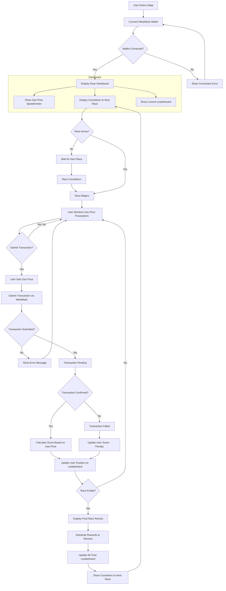

# GasSprint

A competitive dApp where users race to submit Ethereum transactions at the optimal gas price using MetaMask SDK, earning rewards for the most efficient transactions.


https://github.com/user-attachments/assets/4fc3b4dc-43b5-41f8-8a04-a35259bf040d


## Overview

MetaMask Gas Race is an interactive web application that gamifies the process of optimizing gas prices on Ethereum transactions. Users compete in timed race sessions to submit transactions at the lowest possible gas price while ensuring they still get confirmed on the blockchain.

## Features

- **Real-time Gas Price Monitoring**: Dynamic speedometer showing current network gas prices
- **Live Race Sessions**: 5-minute windows where players monitor gas prices and strategically submit transactions
- **Racing Visualization**: Cars that speed up or slow down based on gas prices
- **Leaderboard System**: Track top gas optimizers with token or NFT rewards for winners
- **MetaMask Integration**: Seamless wallet connection and transaction submission
- **Transaction Status Tracking**: Real-time updates on transaction confirmations

## Application Flow



## Technical Implementation

### Core Technologies

- **React**: Frontend framework
- **TypeScript**: Type-safe JavaScript
- **Tailwind CSS**: Utility-first CSS framework
- **Framer Motion**: Animation library
- **MetaMask SDK**: Wallet integration
- **Shadcn UI**: Component library

### Key Components

1. **GasSpeedometer**: Displays current gas prices with visual indicators
2. **RaceTrack**: Visualizes the race with animated cars representing users
3. **RaceControls**: Provides transaction submission controls and race status
4. **Leaderboard**: Shows current race standings and all-time rankings
5. **TransactionStatus**: Displays real-time transaction status updates
6. **RaceHeader**: Handles wallet connection and displays user information

## Environment Variables

The application uses the following environment variables:

```
# API Keys
VITE_ETHERSCAN_API_KEY=your_etherscan_api_key_here
VITE_INFURA_API_KEY=your_infura_api_key_here

# Network Configuration
VITE_NETWORK_ID=1
VITE_NETWORK_NAME=Ethereum Mainnet

# WebSocket Configuration
VITE_WEBSOCKET_URL=wss://demo-gas-race-websocket.example.com

# Race Configuration
VITE_RACE_DURATION=300
VITE_MIN_GAS_PRICE=10
VITE_MAX_GAS_PRICE=100
```

## Installation and Setup

1. Clone the repository
   ```bash
   git clone https://github.com/yourusername/metamask-gas-race.git
   cd metamask-gas-race
   ```

2. Install dependencies
   ```bash
   npm install
   ```

3. Create a `.env` file based on `.env.example` and fill in your API keys

4. Start the development server
   ```bash
   npm run dev
   ```

5. Open your browser and navigate to `http://localhost:5173`

## Deployment

The application can be deployed to any static hosting service:

```bash
npm run build
```

The build output will be in the `dist` directory, which can be deployed to services like Vercel, Netlify, or GitHub Pages.

## Testing on Test Networks

For testing purposes, it's recommended to use Ethereum test networks:

1. Set `VITE_NETWORK_ID` and `VITE_NETWORK_NAME` to a test network (e.g., Sepolia or Goerli)
2. Use a faucet to get test ETH for your MetaMask wallet
3. Transactions on test networks don't cost real ETH, making them perfect for testing

## Contributing

Contributions are welcome! Please feel free to submit a Pull Request.

1. Fork the repository
2. Create your feature branch (`git checkout -b feature/amazing-feature`)
3. Commit your changes (`git commit -m 'Add some amazing feature'`)
4. Push to the branch (`git push origin feature/amazing-feature`)
5. Open a Pull Request

## License

This project is licensed under the Apache-2.0 License - see the LICENSE file for details.

## Acknowledgements

- [MetaMask SDK](https://docs.metamask.io/sdk/)
- [Ethereum Gas Tracker](https://etherscan.io/gastracker)
- [Shadcn UI](https://ui.shadcn.com/)
- [Tailwind CSS](https://tailwindcss.com/)
- [Framer Motion](https://www.framer.com/motion/)
